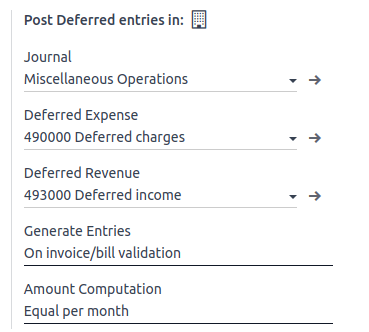
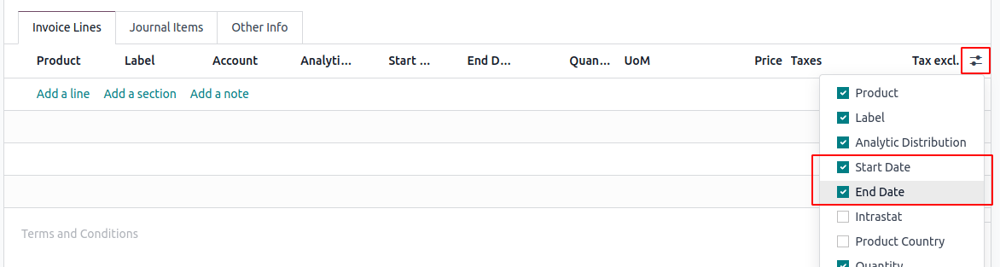
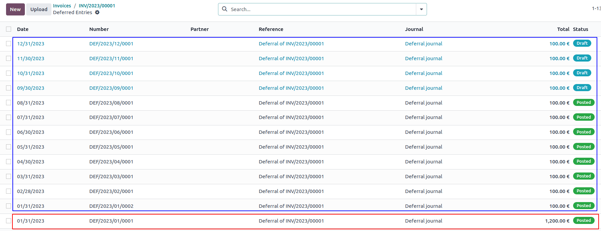
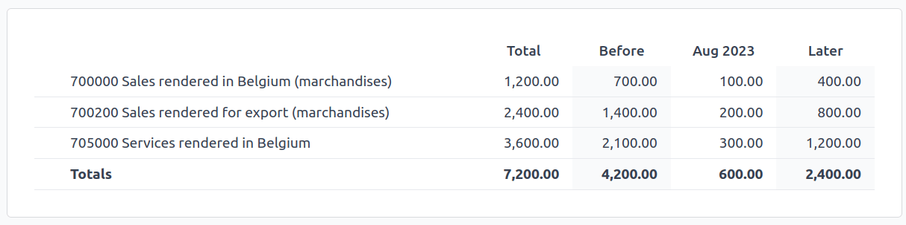

=================
Deferred Revenues
=================

**Deferred revenues**, or **unearned revenues**, are invoices addressed to customers
for goods yet to deliver or services yet to render.

The company cannot report them on the current **Profit and Loss statement**, or *Income Statement*,
since the goods ans services will be effectively delivered/rendered in the future.

These future revenues must be deferred on the company's balance sheet among the current liabilities
until they can be **recognized**, at once or over a defined period, on the Profit and Loss statement.

For example, let's say we sell a five-year extended warranty for $ 350. We immediately invoice it to the
customer but can't considered having it earned it yet. Therefore, we will post 4 out of 5 of it in a
deferred revenue account. Then every year 1 out of 4 will be recognized
as revenue on a yearly basis

Odoo Accounting handles deferred revenues by spreading them in multiple entries that are
posted periodically.

Configuration
=============
Make sure the default settings are
correctly configured for your business. To do so, go to :menuselection:`Accounting --> Configuration
--> Settings`. There, you will find the following options:

- Journal
    The deferral entries will be posted in this journal.
- Deferred Expense Account
    Expenses will be deferred on this Current Asset account until they are recognized.
- Deferred Revenue Account
    Revenues will be deferred on this Current Liability account until they are recognized.
- Generate Entries TODO
    By default, Odoo will :ref:`automatically <Generate deferral entries on validation>` generate the deferral entries when
    you post a customer invoice. However,
    you can also choose to generate them manually by selecting the *Manually & Grouped* option
    instead (see: `Generate grouped deferral entries manually`_).
- Amount Computation
    Suppose you have an invoice of $ 1200 that must
    be deferred over 12 months, the *Equal per month* computation will account for $ 100 each month. While
    the *Based on days* computation will account amounts depending on the number
    of days in the month.

Generate deferral entries on validation
=======================================
Make sure the *Start Date* and *End Date* fields are visible as shown below:

For each line of the invoice, dated in January, you can then specify the start and
end dates of the deferral period. For example, you can defer a sale of $ 1200 over 12 months
by specifying a start date of 01/01/2023 and an end date of 12/31/2024.

.. image:: deferred_revenues/deferred_revenue_example_line.png TODO UPDATE SCREENSHOT
   :align: center
   :alt: Create a deferred invoice

When you validate the invoice, Odoo will automatically generate the deferral entries for you.
You can click the "Deferral Entries" smart button to see them.

One entry reversed the income account and moves it to the deferred account.

The other are deferral entries. In the example above,
as of 08/31/2023, $ 800 are recognized as income, whereas $ 400 remain as deferred income.

The Deferred Revenues Report
===========================

The deferred revenue report computes an overview of the necessary deferral entries for each account.
You can access it by going to :menuselection:`Accounting --> Reporting --> Deferred Revenues`.

.. note::
    Only invoices whose accounting date is before the end of the period of the report are taken into account

Generate grouped deferral entries manually
==========================================

You might want to decrease the number of journal items. Odoo will group the entries that you can generate manually from the report.

At the end of each month, go to the Deferred Revenues report and click the
*Generate Entries* button. This will generate two deferral entries:

- One dated at the end of the month which aggregates, for each account, all the deferred amounts
  of that month. This means that at the end of that period, we have already recognized a part
  of the deferred income.

- The reversal of this created entry, dated on the following day (i.e. the first day of the
  next month).

Example
-------
If we have two invoices:

- Invoice A: $ 1200 to be deferred from 01/01/2023 to 12/31/2023

- Invoice B: $ 600 to be deferred from 01/01/2023 to 12/31/2023

In January
~~~~~~~~~~
At the end of January, after clicking the *Generate Entries* button, we will have the following entries:

- Entry 1 dated on the 31st January:

  - Line 1: Expense account -1200 -600 = -1800 (we cancel the total of both invoices)
  - Line 2: Expense account 100 + 50 = 150 (we recognize 1/12 of invoice A and 1/12 of invoice B)
  - Line 3: Deferred account 1800 - 150 = 1650 (amount that has yet to be deferred later on)

- Entry 2 dated on the 1st February, the reversal of the previous entry:

  - Line 1: Expense account 1800
  - Line 2: Deferred account -150
  - Line 3: Expense account -1650

In February
~~~~~~~~~~~
At the end of February, after clicking the *Generate Entries* button, we will have the following entries:

- Entry 1 dated on the 28th February:

  - Line 1: Expense account -1200 -600 = -1800 (we cancel the total of both invoices)
  - Line 2: Expense account 200 + 100 = 300 (we recognize 2/12 of invoice A and 2/12 of invoice B)
  - Line 3: Deferred account 1800 - 300 = 1500 (amount that has yet to be deferred later on)

- Entry 2 dated on the 1st March, the reversal of the previous entry.

From March to October
~~~~~~~~~~~~~~~~~~~~~
The same computation is done for each month until October.

In November
~~~~~~~~~~~
At the end of November, after clicking the *Generate Entries* button, we will have the following entries:

- Entry 1 dated on the 30th November:

  - Line 1: Expense account -1200 -600 = -1800 (we cancel the total of both invoices)
  - Line 2: Expense account 1100 + 550 = 1650 (we recognize 11/12 of invoice A and 11/12 of invoice B)
  - Line 3: Deferred account 1800 - 1650 = 150 (amount that has yet to be deferred later on)

- Entry 2 dated on the 1st December, the reversal of the previous entry.

In December
~~~~~~~~~~~
There is no need to generate entries in December. Indeed, if we do the computation for December,
we will have an amount of 0 to be deferred.

In total
~~~~~~~~
If we aggregate everything, we would have:

- invoice A and invoice B
- 2 entries (one for the deferral and one for the reversal) for each month from January to November

Therefore, at the end of December, invoices A and B are fully recognized as income,
only once thanks to the reversal mechanism.

Why would you need the "Manually & Grouped" mode?
-------------------------------------------------
Suppose you have 100 invoices.

In "on validation" mode, you would have:
100 invoices * 13 deferral entries (reversal of the original invoices + 12 months) = 1300 deferral entries

In "manually & grouped" mode, you would have:
2 entries (deferral + reversal) * 11 months = 22 entries

The "Manually & Grouped" mode might be useful when you have lots of deferred revenues.
