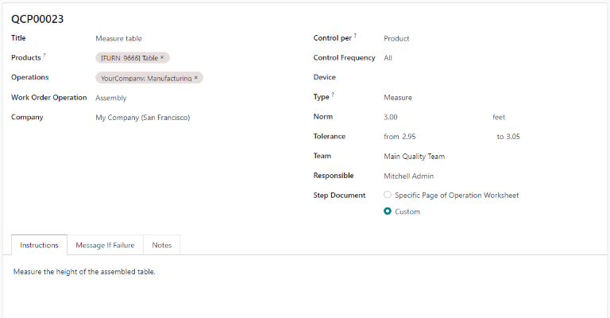
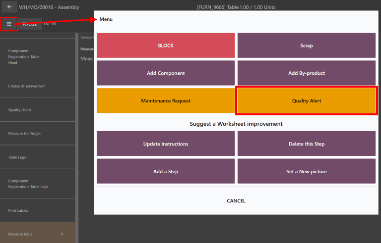

=====================
Measure quality check
=====================

.. |QCP| replace:: :abbr:`QCP (Quality Control Point)`

In Odoo *Quality*, a Measure check is one of the quality check types that can be selected when
creating a new quality check or Quality Control Point (QCP). Measure checks prompt users to measure
a certain aspect of a product and record the measurement in Odoo. For the quality check to pass, the
recorded measurement must be within a certain *tolerance* of a *norm* value.

There are two distinct ways that Measure quality checks can be created. A single check can be
manually created. Alternatively, a |QCP| can be configured that automatically creates checks at a
predetermined interval.

This documentation only details the configuration options and processing steps that are unique to
Measure quality checks. For a full overview of all the configuration options available when creating
a single check or a |QCP|, see the documentation on :ref:`Quality checks
<manufacturing/quality_control/quality-checks>` and :ref:`Quality Control Points
<manufacturing/quality_control/quality-control-points>`.

Create a Measure quality check
==============================

Measure quality checks can be created by navigating to :menuselection:`Quality --> Quality Control
--> Quality Checks`, and clicking :guilabel:`New`. It is also possible to create a |QCP| that is
configured to automatically create a Measure quality check when certain criteria is met. To do so,
navigate to :menuselection:`Quality --> Quality Control --> Control Points`, and click
:guilabel:`New`.

On the quality check or |QCP| form, select :guilabel:`Measure` from the :guilabel:`Type` drop-down
field. Upon doing so, three new sections appear on the form:

- :guilabel:`Device` is used to specify an IoT device that should be used to take the measurement
- :guilabel:`Norm` is used to define the ideal measurement that the product should conform to.
- :guilabel:`Tolerance` is used to define the acceptable range of measurements that the product can
  be within while still passing the quality check.

If an IoT-connected device will be used to take the measurement, select it from the
:guilabel:`Device` drop-down menu. For more information about IoT measurement devices, see the
documentation on how to :ref:`Connect a measurement tool <iot/devices/measurement-tool>`.

The :guilabel:`Norm` section has two text entry fields. In the first field, enter the number of the
measurement that the product should conform to. In the second field, enter the unit for that
measurement (centimeters, meters, etc.).

The :guilabel:`Tolerance` section also has two text entry fields, titled :guilabel:`from` and
:guilabel:`to`. In the :guilabel:`from` field, enter the minimum measurement that the product can
have while still passing the check. In the :guilabel:`to` field, enter the maximum measurement that
the product can have while still passing the check.

Next, enter the instructions for how to measure the product (ex. measure the height of the table
after it is assembled). If a single quality check is being created, instructions can be entered in
the :guilabel:`Instructions` field of the :guilabel:`Notes` tab. If a Quality Control Point is being
configured, enter them directly in the :guilabel:`Instructions` tab.

Finally, select the :guilabel:`Message If Failure` tab. In the field below, enter instructions for
what should be done if the quality check fails.

Process a measure quality check
===============================

To process a Measure quality check, select a manufacturing order or inventory order (receipt,
delivery, return, etc.), for which a check is required. Manufacturing orders can be selected by
navigating to :menuselection:`Manufacturing --> Operations --> Manufacturing Orders`, and clicking
on an order. Inventory orders can be selected by navigating to :menuselection:`Inventory`, clicking
the :guilabel:`# To Process` button on an operation card, and selecting an order.

On the selected inventory or manufacturing order, a purple :guilabel:`Quality Checks` button appears
at the top of the order. Click the button to open the :guilabel:`Quality Check` pop-up window, which
shows all of the quality checks required for that order.

To complete a Measure quality check, measure the product as instructed, then enter the value in the
:guilabel:`Measure` field on the pop-up window. Finally, click :guilabel:`Validate` to register the
recorded value.

.. image:: measure_check/measure-check-pop-up.png
   :align: center
   :alt: A Measure quality check pop-up window on a manufacturing or inventory order.

If the value entered is within the range specified in the :guilabel:`Tolerance` section of the
quality check or |QCP|, the quality check passes and the pop-up window closes. The rest of the
manufacturing or inventory order can then be processed as usual.

However, if the value entered is outside of the specified range, a new pop-up window appears, titled
:guilabel:`Quality Check Failed`. The body of the pop-up shows a warning message that states, "You
measured # units and it should be between # units and # units.", as well as the instructions entered
in the :guilabel:`Message If Failure` tab of the quality check or |QCP|. At the bottom of the
pop-up, two buttons appear: :guilabel:`Correct Measure` and :guilabel:`Confirm Measure`.

.. image:: measure_check/measure-check-failed.png
   :align: center
   :alt: The "Quality Check Failed" pop-up window.

If the measurement is incorrect and should be changed, select :guilabel:`Correct Measure`. Doing so
re-opens the :guilabel:`Quality Check` pop-up window. Enter the corrected measurement in the
:guilabel:`Measure` field, then click :guilabel:`Validate` to complete the check.

If the measurement is correct, click :guilabel:`Confirm Measure` instead, and the quality check
fails. Follow any instructions that were listed on the :guilabel:`Quality Check Failed` pop-up
window.

If a quality alert must be created, click the :guilabel:`Quality Alert` button that appears at the
top of the manufacturing or inventory order after the check fails. Clicking
:guilabel:`Quality Alert` opens a quality alert form on a new page. For a complete guide on how to
fill out the quality alert form, view the documentation on :ref:`Quality alerts
<manufacturing/quality_control/quality-alerts>`.

Process a work order Measure quality check
==========================================

When configuring a |QCP| that is triggered during manufacturing, a specific work order can also be
specified in the :guilabel:`Work Order Operation` field on the |QCP| form. If a work order is
specified, a Measure quality check is created for that specific work order, rather than the
manufacturing order as a whole.

Measure quality checks configured for work orders must be completed from the tablet view. To do so,
begin by navigating to :menuselection:`Manufacturing --> Operations --> Manufacturing Orders`.
Select a manufacturing order that includes a work order for which a quality check is required. Open
the tablet view for that work order by clicking the :guilabel:`📱 (tablet)` tablet view button on
the order's line.

With tablet view open, complete the steps listed on the left side of the screen until the Measure
quality check step is reached. Upon reaching the check, the instructions for how to take the
measurement appear at the top of the screen. Enter the measured value in the :guilabel:`Measure`
field above the instructions, the click :guilabel:`Validate`.

If the measurement entered is within the range specified in the :guilabel:`Tolerance` section of the
quality check or |QCP|, the quality check passes and the tablet view moves on to the next step of
the work order. However, if the measurement entered is outside of the specified range, a pop-up
window appears, titled :guilabel:`Quality Check Failed`.

The body of the :guilabel:`Quality Check Failed` pop-up window shows a warning message that states,
"You measured # units and it should be between # units and # units.", as well as the instructions
entered in the :guilabel:`Message If Failure` tab of the quality check or |QCP|. At the bottom of
the pop-up, two buttons appear: :guilabel:`Correct Measure` and :guilabel:`Confirm Measure`.

.. image:: measure_check/measure-check-failed.png
   :align: center
   :alt: The "Quality Check Failed" pop-up window.

If the measurement is incorrect and should be changed, select :guilabel:`Correct Measure`. Doing so
opens a new pop-up window, titled :guilabel:`Quality Check`. Enter the corrected measurement in the
:guilabel:`Measure` field, then click :guilabel:`Validate` to complete the check and move on the
next step of the work order.

If the measurement is correct, click :guilabel:`Confirm Measure` instead, and the quality check
fails. Follow any instructions that were listed on the :guilabel:`Quality Check Failed` pop-up
window.

If a quality alert must be created, do so by clicking the :guilabel:`☰ (menu)` tablet view menu
button, and selecting :guilabel:`Quality Alert` from the :guilabel:`Menu` pop-up window. A
:guilabel:`Quality Alerts` pop-up window appears, from which a quality alert can be created. For a
complete guide to quality alert creation, view the documentation on :ref:`Quality alerts
<manufacturing/quality_control/quality-alerts>`.

