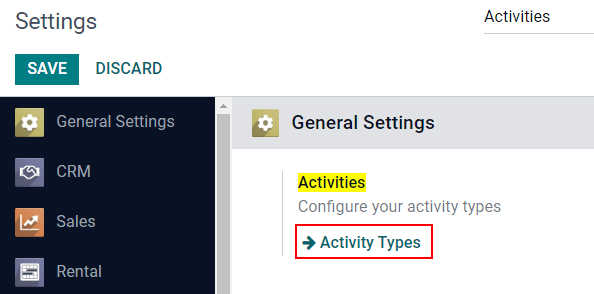

==========
Activities
==========

*Activities* are follow-up tasks tied to a record in an Odoo database. Activities can be scheduled
on any page of the database that contains a chatter thread.

Schedule activities
===================

Activities are created by clicking the :guilabel:`Schedule Activity` button, located above the
*chatter* on any record. On the popup window, select an :guilabel:`Activity Type` from the
drop-down.

.. tip::
   Individual applications will have a list of the *Activity Types* for that application. For
   example, to view and edit the activities available for the *CRM* application, go to
   :menuselection:`CRM --> Configuration --> Activity Types`.

Enter a title for the activity in the :guilabel:`Summary` field. To assign the activity to a
different user, select their name from the :guilabel:`Assigned to` drop-down. Otherwise, the user
creating the activity will be automatically assigned. Add any additional information in the
:guilabel:`Log a note...` field.

.. note::
   The :guilabel:`Due Date` will auto-populate based on the configuration settings for the selected
   activity type. This date can be changed by selecting a day on the calendar in the :guilabel:`Due
   Date` field.

Click :guilabel:`Schedule`.

.. image:: plan_activities/schedule-pop-up.png
   :align: center
   :alt: View of CRM leads and the option to schedule an activity.

.. note::
   Depending on the activity type, the :guilabel:`Schedule` button may be replaced by a
   :guilabel:`Save` button, or an ::guilabel:`Open Calendar` button.

Scheduled activities are added to the chatter for the record under :guilabel:`Planned activities`.

.. image:: plan_activities/chatter-activities.png
   :align: center
   :alt: View of CRM leads and the option to schedule an activity.

Activities can also be scheduled from the kanban, list, or activities view of an application.

.. tabs::

   .. tab:: Kanban view

      Select a record on which to schedule an activity. Click on the :guilabel:`🕘 (clock)` icon,
      then :guilabel:`Schedule An Activity`.

    .. image:: plan_activities/schedule-kanban-activity.png
       :align: center
       :alt: Kanban view of the CRM pipeline and the option to schedule an activity.

   .. tab:: List view

      Select a record on which to schedule an activity. Click on the :guilabel:`🕘 (clock)` icon,
      then :guilabel:`Schedule An Activity`. If the record already has an activity scheduled, the
      clock icon may be replaced by a :guilabel:`📞 (phone)` or an :guilabel:`✉️ (envelope)` icon.

    .. image:: plan_activities/schedule-list-activity.png
       :align: center
       :alt: List view of the CRM pipeline and the option to schedule an activity.

   .. tab:: Activity view

      Select a record on which to schedule an activity. Move across the row to find the desired
      activity type, then click the :guilabel:`＋ (plus sign)`.

    .. image:: plan_activities/schedule-activity-view.png
       :align: center
       :alt: Activity view of the CRM pipeline and the option to schedule an activity.

View scheduled activities
=========================

To view scheduled activities, click the :guilabel:`🕘 (clock)` icon on the menu bar. Doing so opens
the :guilabel:`Activities menu`. Activities are separated out by the application where they were
created, and by deadline. Select an icon to see the activities for that specific application.

.. image:: plan_activities/activities-menu.png
   :align: center
   :alt: View of CRM leads page emphasizing the activities menu.

Configure activity types
========================

To configure the types of activities in the database, go to :menuselection:`Settings application -->
Activities --> Activity Types`.

To edit an existing activity type, select it from the list, then click :guilabel:`Edit`. To create a
new activity type, click :guilabel:`Create`.

Choose a :guilabel:`Name` for the new activity type.

.. image:: plan_activities/new-activity-type.png
   :align: center
   :alt: New activity type form.

Activity settings
-----------------

Action
~~~~~~

*Actions* specify the intent of the activity. Some actions trigger specific behavior after an
activity is scheduled.

- If either **Phonecall** or **Meeting** are selected, users will have the option to open their
  calendar to schedule a time for this activity.
- If **Upload Document** is selected, a link to upload a document will be added directly to the
  planned activity in the chatter.
- If **Request Signature** is selected, a link will be added to the planned activity in the chatter
  that will open a signature request pop-up.

.. note::
   The actions available to select on an activity type will vary depending on the applications that
   are currently installed in the database.

Default user
~~~~~~~~~~~~

To automatically assign this activity to a specific user when this activity type is scheduled,
choose a name from the :guilabel:`Default User` drop-down. If this field is left blank, the activity
will be assigned to the user who creates the activity.

Default summary
~~~~~~~~~~~~~~~

To include any notes every time this activity type is created, enter them into the
:guilabel:`Default Summary` field.

.. note::
   The information in the :guilabel:`Default User` and :guilabel:`Default Summary` fields will be
   included when an activity is created. However, they can be altered before the activity is
   scheduled or saved.

Next activity
-------------

To automatically suggest or trigger a new activity after an activity has been marked complete, the
*chaining type* must be set.

Suggest next activity
~~~~~~~~~~~~~~~~~~~~~

In the :guilabel:`Chaining Type` field, select :guilabel:`Suggest Next Activity`. The field
underneath will now be titled :guilabel:`Suggest`. Select any activities to recommend as follow-up
tasks to this activity type.

In the :guilabel:`Schedule` field, choose a default deadline for these activities. This can be
altered before the activity is scheduled.

Click :guilabel:`Save`.

.. figure:: plan_activities/schedule-recommended-activity.png
   :align: center
   :alt: Schedule activity popup with emphasis on recommended activities.

   If an activity has the chaining type set to suggest, and has activities listed in the Suggest
   field, users are presented with recommendations for activities as next steps.

Trigger next activity
~~~~~~~~~~~~~~~~~~~~~

Setting the *chaining type* to *trigger* immediately launches the next activity once the previous
one is completed.

In the :guilabel:`Chaining Type` field, select :guilabel:`Trigger Next Activity`. The field
underneath will now be titled :guilabel:`Trigger`. Select the activity that should be launched once
this activity is completed.

In the :guilabel:`Schedule` field, choose a default deadline for these activities. This can be
altered before the activity is scheduled.

Click :guilabel:`Save`.

.. figure:: plan_activities/triggered-activities.png
   :align: center
   :alt: Schedule new activity popup with emphasis on Done and launch next button.

   When an activity has the chaining type set to trigger, marking the activity as Done immediately
   launches the next.

.. seealso::
   - :doc:`get_started`
   - :doc:`team_communication`
